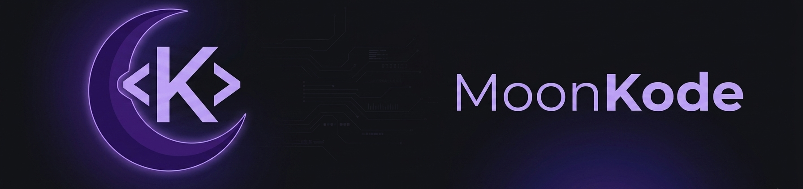

  <!-- replace banner.png with your uploaded file name if different -->
  

   

  ### 🌌 Full Stack Developer | Go & TypeScript Enthusiast
  *Transforming complex ideas into elegant, high-performance code.*

  

    
    
    
    
  

---

### 🛠️ Tech Ecosystem
- **Backend:** Building scalable architectures using **Go** and **Node.js**.
- **Frontend:** Crafting modern, high-performance interfaces with **Next.js** and **Tailwind CSS**.
- **Database:** Proficient in **PostgreSQL**, **Redis**, and data modeling.
- **DevOps:** Containerization with **Docker** and automated CI/CD pipelines.

### 📈 Code Statistics

  
  

---

### 📫 Connect with me
[LinkedIn](YOUR_LINK_HERE) | [Portfolio](YOUR_LINK_HERE) | [Email](mailto:your-email@example.com)
